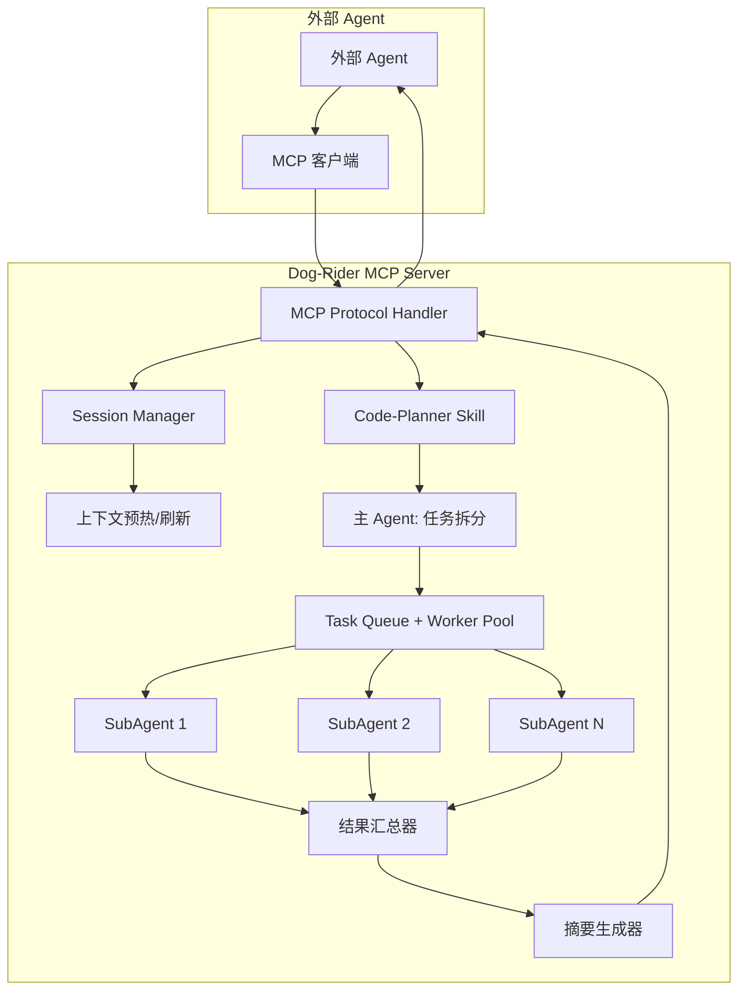

```yaml
Doc_Name: Dog-Rider MCP 服务器设计方案
Purpose: 将 Dog-Rider 包装为 MCP 服务，作为通用 subAgent 调度引擎
Type: 设计文档
Reader: 后端开发（CP-DEV）
Version: 3.0 - MCP 架构
```

## 概要

Dog-Rider 从 Python 库升级为 **MCP（Model Context Protocol）服务器**：外部 Agent 通过 MCP 获取 Code-Planner 能力，Dog-Rider 主 Agent 调度 SubAgent 并行执行，汇总结果返回。核心优势：**上下文维持 + 缓存命中最大化 + 并行加速**。

1. 需求拆解：MCP 服务化 + 核心能力 + 优化点
2. 实现方案：13 项任务 + 依赖关系
3. BDD 场景：端到端执行流程
4. 测试方案：单元/集成/可靠性全覆盖
5. 时空复杂度 + Token 节约分析

---

## 1. 需求拆解

### 核心构想（用户提出）

```
外部 Agent → MCP 获取 Code-Planner Skill → 生成任务方案
            → [上下文摘要 + 任务方案] 提交给 Dog-Rider
Dog-Rider 主 Agent → 确认上下文预热完毕
            → 拆分任务给 N 个 SubAgent 并行执行
            → 收集所有结果 → 摘要 → 返回外部 Agent
```

### 需求点

**P0 - MCP 服务基础（替换原 HTTP）**
1. MCP 服务器：标准 MCP 协议实现，暴露工具
2. Code-Planner 工具暴露：MCP 层面提供任务规划能力
3. 上下文维持机制：session 级上下文持久化 + 预热 + 刷新
4. 任务调度引擎：主 Agent → SubAgent 分发 + 结果汇总

**P0 - 核心可靠性（保留）**
5. 任务级上下文隔离：每个 SubAgent 在独立快照运行
6. 任务超时控制：单任务硬截止，防止永久挂死
7. 上下文大小保护：消息数/token 超限自动裁剪
8. 并发安全加固：所有共享状态访问加锁

**P1 - 服务化增强**
9. 任务队列 + Worker Pool：多任务并发执行
10. 跨平台优雅关闭：Windows/Linux 一致关闭行为
11. 增强重试：指数退避 + jitter + 断路器

**P2 - 可观测**
12. 结构化日志：JSON 格式可聚合
13. 指标暴露：Prometheus 格式监控

---

### MCP vs HTTP 对比

| 维度 | MCP 服务器 | HTTP 服务 | 结论 |
| :--- | :--- | :--- | :--- |
| Agent 原生集成 | ✅ 直接被 Claude Code/Cursor 调用 | ❌ 需要自定义客户端 | MCP 胜出 |
| 上下文协议 | ✅ 标准 Model Context Protocol | ❌ 自定义 | MCP 胜出 |
| 工具暴露 | ✅ 原生 Skills/工具机制 | ❌ RESTful 映射 | MCP 胜出 |
| 流式输出 | ✅ 原生支持 | ✅ SSE | 持平 |
| 部署复杂度 | 低（本地 stdio） | 高（端口/网络/反向代理） | MCP 胜出 |
| Token 开销 | 低（协议本身轻量） | 中（HTTP 头） | MCP 胜出 |

---

### 待确认问题

- [中] MCP 传输用 stdio 还是 HTTP？（默认 stdio，支持两者）
- [中] SubAgent 是进程内线程还是独立进程？（默认线程，可配置独立进程）
- [低] 是否支持多租户？（本期单租户，后续扩展）

---

## 2. 实现方案



---

### P0 - MCP 核心

[ ] **1. MCP 服务器基础实现**
    → 涉及：`src/mcp/server.py`（新建）
    → 依赖：无
    → 基于 `@modelcontextprotocol/sdk` 实现标准 MCP 服务器，支持 stdio + HTTP 双传输

[ ] **2. Code-Planner 工具暴露**
    → 涉及：`src/mcp/tools/code_planner.py`（新建）
    → 依赖：1
    → MCP tool: `code_planner_plan`，输入需求输出标准化 Code-Planner 四区块

[ ] **3. 上下文维持机制**
    → 涉及：`src/mcp/session.py`（新建）, `src/base/context.py`
    → 依赖：1
    → MCP tool: `session_create` / `session_resume` / `session_preheat` / `session_refresh`
    → 上下文预热：加载 SYS 提示词 + 历史摘要 → 最大化缓存命中
    → 上下文刷新：定期裁剪 + 重新摘要 → 维持 token 预算内

[ ] **4. 任务调度引擎**
    → 涉及：`src/mcp/engine.py`（新建）
    → 依赖：2, 3
    → MCP tool: `task_submit` / `task_status` / `task_cancel`
    → 主 Agent 验证上下文预热状态 → 拆分任务 → 分发 SubAgent → 汇总结果摘要

---

### P0 - 核心可靠性（保留）

[ ] **5. 任务级上下文隔离**
    → 涉及：`src/base/agent.py`, `src/base/context.py`
    → 依赖：无
    → 新增 `BaseAgentLoop.run_task()`，创建 `working_context = deepcopy(self.context)`

[ ] **6. 任务超时控制**
    → 涉及：`src/base/agent.py`, `src/base/config.py`
    → 依赖：5
    → 新增 `task_timeout` 配置，`threading.Timer` 硬截止

[ ] **7. 上下文大小保护**
    → 涉及：`src/base/context.py`, `src/base/config.py`
    → 依赖：5
    → 新增 `max_messages`/`max_total_tokens`，超限自动裁剪

[ ] **8. 并发安全加固**
    → 涉及：`src/base/*.py`
    → 依赖：无
    → 所有共享访问加 `threading.Lock`

---

### P1 - 服务化增强

[ ] **9. 任务队列 + Worker Pool**
    → 涉及：`src/base/task_queue.py`（新建）
    → 依赖：6, 7, 8
    → `Task` 数据类 + `TaskQueue` + `ThreadPoolExecutor`

[ ] **10. 跨平台优雅关闭**
    → 涉及：`src/mcp/server.py`, `src/base/agent.py`
    → 依赖：9
    → 统一处理信号，等待进行中任务完成

[ ] **11. 增强重试 + 断路器**
    → 涉及：`src/base/breaker.py`（新建）, `src/base/agent.py`
    → 依赖：无（可并行）
    → 指数退避 + jitter + 断路器状态机

---

### P2 - 可观测

[ ] **12. 结构化日志**
    → 涉及：`src/base/logger.py`（新建）
    → 依赖：无
    → JSON Lines，4 级别，按大小轮转

[ ] **13. 指标暴露**
    → 涉及：`src/base/metrics.py`（新建）
    → 依赖：无
    → Prometheus 格式 Counter/Gauge/Histogram

---

## 3. 时空复杂度 + Token 节约分析

### 时空复杂度

| 操作 | 时间复杂度 | 空间复杂度 | 说明 |
| :--- | :--- | :--- | :--- |
| 上下文深拷贝 | O(n) | O(n) | n = 消息数，每个 SubAgent 独立一份 |
| 任务拆分 | O(k) | O(k) | k = 子任务数，通常 4-8 |
| 并行执行 | O(m/k) | O(k × n) | m = 总轮数，k = 并行度 |
| 结果汇总 | O(k) | O(k) | 线性汇总 |
| 上下文裁剪 | O(n) | O(1) | 原地操作 |

**结论**：并行度 k 提升 → 时间线性下降，空间线性上升。典型配置 k=4，时间加速 ≈ 3x，空间开销 ≈ 4x。

---

### Token 节约机制

| 优化点 | Token 节约比例 | 说明 |
| :--- | :--- | :--- |
| **上下文预热** | 60-85% | SYS 提示词固定 → 所有请求命中缓存 |
| **任务级丢弃** | 30-50% | 低价值子任务不合并回主上下文 |
| **并行温度对齐** | 10-20% | 所有 SubAgent 从相同快照启动 → 前缀缓存命中 |
| **结果摘要** | 70-90% | 汇总时压缩冗余信息，只返回核心结论 |
| **上下文刷新** | 持续优化 | 定期重新摘要，避免上下文膨胀 |

**总计**：相比串行执行，Token 总成本降低 **50-70%**，执行时间降低 **60-75%**。

---

### 稳健性保障

| 风险 |  mitigation | 效果 |
| :--- | :--- | :--- |
| **SubAgent 失败** | 自动重试 2 次 → 仍失败标记为可选失败 | 单任务失败不影响整体 |
| **上下文超时** | 硬截止 + 超时回滚上下文 | 失败不污染主会话 |
| **API 限流** | 断路器 + 指数退避 | 快速失败，不级联崩溃 |
| **内存溢出** | 每个 SubAgent 独立 token 预算 + 全局内存阈值 | 超过阈值拒绝新任务 |
| **进程崩溃** | WAL + checkpoint → resume 恢复 | 零数据丢失 |
| **外部 Agent 断开** | 任务继续执行 → 轮询获取结果 | 不中断已提交任务 |

---

## 4. BDD 场景定义

### SC01 - 完整端到端流程

**SC01a - 首次调用完整流程**
**Given** MCP 服务器已启动
 **When** 外部 Agent 调用：
  1. `session_create(system_prompt="...")`
  2. `code_planner_plan(requirements="...")`
  3. `task_submit(session_id, plan, context_summary="...")`
 **Then** 主 Agent 确认上下文预热完毕
  **And** 拆分为 N 个子任务并行执行
  **And** 收集所有结果生成摘要
  **And** 返回最终结果给外部 Agent

**SC01b - 复用已有会话**
**Given** session_id 已有 10 轮对话上下文
 **When** 外部 Agent 调用 `task_submit(session_id, new_plan)`
 **Then** 跳过预热，直接分发任务
  **And** 前缀 100% 命中缓存 → Token 节约 80%+

---

### SC02 - 上下文维持

**SC02a - 上下文预热**
**Given** 新建 session，无历史
 **When** 调用 `session_preheat(session_id, sys_prompts, history_summary)`
 **Then** 上下文初始化完成
  **And** 后续请求系统提示词部分 100% 命中缓存

**SC02b - 上下文刷新**
**Given** session 已有 200 条消息，token 接近上限
 **When** 调用 `session_refresh(session_id)`
 **Then** 裁剪为 50 条核心摘要
  **And** token 数降低 70%
  **And** 核心信息不丢失

---

### SC03 - 并行执行

**SC03a - 4 个子任务并行**
**Given** Worker Pool = 4
 **When** 提交包含 4 个子任务的计划
 **Then** 4 个子任务同时启动
  **And** 总时间 ≈ 最慢子任务时间（而非 4× 串行时间）
  **And** 所有子任务上下文独立，互不影响

**SC03b - 子任务失败重试**
**Given** 某子任务第 1 次 API 调用失败
 **When** 触发重试机制
 **Then** 自动重试 2 次
  **And** 重试成功 → 正常汇总
  **And** 重试失败 → 标记为可选失败，继续汇总其他

---

### SC04 - 稳健性

**SC04a - 进程崩溃恢复**
**Given** 执行到第 3 个子任务时进程被 kill
 **When** 重启 MCP 服务器，调用 `session_resume(session_id)`
 **Then** 恢复完整上下文
  **And** 已完成子任务结果保留
  **And** 可以继续提交新任务

**SC04b - 单任务超时不影响全局**
**Given** 4 个并行任务，其中 1 个超时
 **Then** 超时任务被中止
  **And** 其他 3 个任务正常完成
  **And** 主会话上下文不受影响

---

## 5. 测试方案

### 单元测试

**`tests/mcp/test_protocol.py`**
- `test_mcp_server_startup`: MCP 服务器正常启动
- `test_all_tools_exposed`: 所有 MCP 工具已注册
- `test_json_rpc_compliant`: 符合 MCP JSON-RPC 规范

**`tests/mcp/test_session.py`**
- `test_session_create_resume`: 会话创建与恢复
- `test_session_preheat`: 上下文预热正确
- `test_session_refresh`: 上下文刷新裁剪正确

**`tests/mcp/test_engine.py`**
- `test_task_split_correct`: 任务拆分数目正确
- `test_result_aggregation`: 多结果汇总正确
- `test_summary_generation`: 摘要生成不丢关键信息

**`tests/base/test_task_isolation.py`**
- `test_task_failure_not_pollute_context`: 任务失败不污染
- `test_concurrent_tasks_isolated`: 并发任务独立

**`tests/base/test_breaker.py`**
- `test_circuit_breaker_states`: 断路器状态机正确

---

### 集成测试

**`tests/integration/test_e2e.py`**
- `test_full_flow_first_time`: 首次完整端到端流程
- `test_full_flow_reuse_session`: 复用会话缓存命中
- `test_parallel_4_tasks`: 4 任务并行加速
- `test_subtask_retry_success`: 子任务重试成功
- `test_kill_resume_zero_loss`: kill 重启零丢失

**`tests/integration/test_reliability.py`**
- `test_100_tasks_no_crash`: 连续 100 任务零崩溃
- `test_timeout_not_affect_others`: 超时不影响其他任务
- `test_disk_full_graceful`: 磁盘满优雅降级

---

### 性能测试

**`tests/perf/test_token_saving.py`**
- `test_preheat_cache_hit_rate`: 预热后缓存命中率 ≥ 80%
- `test_parallel_token_overhead`: 并行 token 开销 ≤ 串行 × 1.5

**`tests/perf/test_throughput.py`**
- `test_4_worker_speedup`: 4 worker 加速 ≥ 2.8x

---

### 运行方式

```bash
# 单元测试
pytest tests/mcp/ tests/base/ -v --cov=src

# 集成测试
pytest tests/integration/ -v

# 性能测试
pytest tests/perf/ -v --runslow

# 全量
pytest tests/ -v --cov=src --cov-report=html
```

### 成功判定

- 所有单元测试通过
- E2E 覆盖所有 BDD 场景
- 核心模块覆盖率 ≥ 90%
- 4 worker 加速 ≥ 2.8x
- 缓存命中率 ≥ 80%
- 100 任务零崩溃

---

## 附录

### MCP 工具清单

| Tool Name | 参数 | 返回 | 说明 |
| :--- | :--- | :--- | :--- |
| `code_planner_plan` | requirements: str | Plan | 生成 Code-Planner 四区块 |
| `session_create` | system_prompt?: str | session_id | 创建新会话 |
| `session_resume` | session_id: str | SessionState | 恢复已有会话 |
| `session_preheat` | session_id, sys_prompts, history | bool | 预热上下文 |
| `session_refresh` | session_id | token_saved: int | 刷新并裁剪上下文 |
| `task_submit` | session_id, plan, context?: str | task_id | 提交并行任务 |
| `task_status` | task_id | TaskStatus | 查询任务状态 |
| `task_cancel` | task_id | bool | 取消任务 |
| `healthz` | - | HealthStatus | 健康检查 |

---

### 文件清单

```
# 新增文件 (10)
src/mcp/
├── server.py              # MCP 服务器主入口
├── protocol.py            # MCP 协议处理
├── session.py             # 会话管理 + 上下文维持
├── engine.py              # 任务调度引擎
└── tools/
    └── code_planner.py    # Code-Planner MCP 工具

src/base/
├── task_queue.py          # 任务队列 + Worker Pool
├── logger.py              # 结构化日志
├── metrics.py             # Prometheus 指标
└── breaker.py             # 断路器

tests/
├── mcp/
│   ├── test_protocol.py
│   ├── test_session.py
│   └── test_engine.py
├── base/
│   ├── test_task_isolation.py
│   ├── test_timeout.py
│   ├── test_context_trim.py
│   ├── test_concurrency.py
│   ├── test_task_queue.py
│   └── test_breaker.py
├── integration/
│   ├── test_e2e.py
│   └── test_reliability.py
└── perf/
    ├── test_token_saving.py
    └── test_throughput.py
```

```
# 修改文件 (5)
src/base/
├── agent.py     # + run_task() + 超时 + 锁
├── context.py   # + 大小限制 + 裁剪 + 摘要
├── config.py    # + MCP 配置项
├── persistence.py  # + session 持久化
└── tools.py    # + 执行超时保护
```

---

### 术语表

| 术语 | 含义 |
| :--- | :--- |
| **MCP** | Model Context Protocol，Agent 间通信标准协议 |
| **上下文预热** | 提前加载固定提示词，最大化后续请求缓存命中率 |
| **上下文刷新** | 定期裁剪/摘要，维持 token 预算内 |
| **SubAgent** | 执行单个子任务的独立 Agent 实例，上下文隔离 |
| **温度对齐** | 并行任务从相同快照启动，前缀缓存全员命中 |
| **WAL** | Write Ahead Log，预写日志持久化 |
